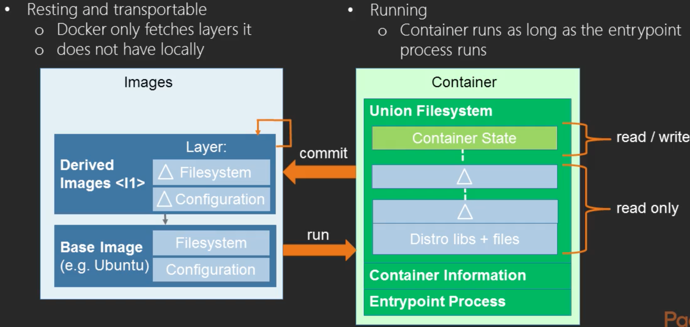
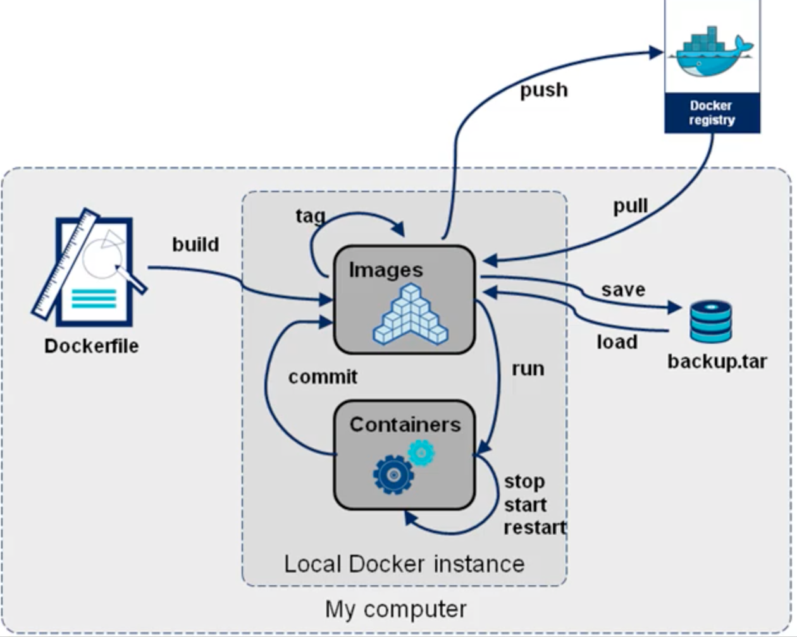
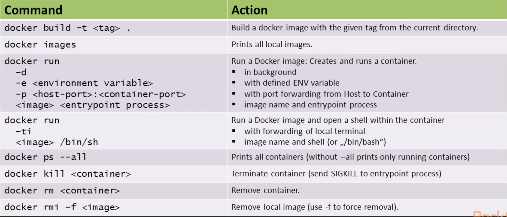

<!-- PROJECT SHIELDS -->
<!--
*** I'm using markdown "reference style" links for readability.
*** Reference links are enclosed in brackets [ ] instead of parentheses ( ).
*** See the bottom of this document for the declaration of the reference variables
*** for contributors-url, forks-url, etc. This is an optional, concise syntax you may use.
*** https://www.markdownguide.org/basic-syntax/#reference-style-links
-->
[![LinkedIn][linkedin-shield]][linkedin-url]

<!-- PROJECT LOGO -->
 

  

<h3 align="center">Basic Docker Workflow and Docker Commands</h3>

<!-- TABLE OF CONTENTS -->

  
Table of Contents

  <ol>
    <li>
      <a href="#about-the-project">About The Project</a>
      <ul>
      </ul>
    </li>
    <li>
      <a href="#getting-started">Getting Started</a>
      <ul>
      </ul>
    </li>
    <li><a href="#contact">Contact</a></li>
  </ol>

<!-- ABOUT THE PROJECT -->
## About The Project

Hardware versus OS virtualization
- Hardware Virtualization - Isolated Hardware
	- Application
	- OS Libraries
	- OS
	- Virtual Hardware (Hardware Software Interface)
	- Real Hardware (Shared Resources)
- Hardware Virtualization Advantage: 
	- Stronger Isolation
- OS Virtualization - Isolated NW-interface, process space, file system
	- Application
	- OS Libraries (System Call Interface)
	- OS (Shared Resources)
	- Virtual Hardware (Shared Resources)
	- Real Hardware (Shared Resources)
- OS Virtualization Advantage:
	- Less volume of private copy
	- Near zero runtime overhead (RAM, CPU)
	- Shorter start-up time

  <h3 align="left">Docker images and containers</h3> 
  

  <h3 align="left">The Docker workflows</h3> 
  

  <h3 align="left">Some basic Docker commands</h3> 
  

(<a href="#top">back to top</a>)

<!-- Motivation for Cloud Native Apps -->
## Motivation for Cloud Native Apps

  

In progress

(<a href="#top">back to top</a>)

<!-- GETTING STARTED -->
## Getting Started

<!-- USAGE EXAMPLES -->
## Usage

(<a href="#top">back to top</a>)

<!-- CONTACT -->
## Contact

Sheldon Pang - SheldonLinkedin@yahoo.com

Project Link: [https://github.com/Sheldon_Pang/Cloud-Native-Go](https://github.com/Sheldon_Pang/Cloud-Native-Go)

(<a href="#top">back to top</a>)

<!-- MARKDOWN LINKS & IMAGES -->
<!-- https://www.markdownguide.org/basic-syntax/#reference-style-links -->
[contributors-shield]: https://img.shields.io/github/contributors/Sheldon_Pang/To-Do-App-with-Jetpack-Compose.svg?style=for-the-badge
[contributors-url]: https://github.com/Sheldon_Pang/To-Do-App-with-Jetpack-Compose/graphs/contributors
[forks-shield]: https://img.shields.io/github/forks/Sheldon_Pang/To-Do-App-with-Jetpack-Compose.svg?style=for-the-badge
[forks-url]: https://github.com/Sheldon_Pang/To-Do-App-with-Jetpack-Compose/network/members
[stars-shield]: https://img.shields.io/github/stars/Sheldon_Pang/To-Do-App-with-Jetpack-Compose.svg?style=for-the-badge
[stars-url]: https://github.com/Sheldon_Pang/To-Do-App-with-Jetpack-Compose/stargazers
[issues-shield]: https://img.shields.io/github/issues/Sheldon_Pang/To-Do-App-with-Jetpack-Compose.svg?style=for-the-badge
[issues-url]: https://github.com/Sheldon_Pang/To-Do-App-with-Jetpack-Compose/issues
[license-shield]: https://img.shields.io/github/license/Sheldon_Pang/To-Do-App-with-Jetpack-Compose.svg?style=for-the-badge
[license-url]: https://github.com/Sheldon_Pang/To-Do-App-with-Jetpack-Compose/blob/master/LICENSE.txt
[linkedin-shield]: https://img.shields.io/badge/-LinkedIn-black.svg?style=for-the-badge&logo=linkedin&colorB=555
[linkedin-url]: https://linkedin.com/in/Sheldon-Pang
[Next.js]: https://img.shields.io/badge/next.js-000000?style=for-the-badge&logo=nextdotjs&logoColor=white
[Next-url]: https://nextjs.org/
[React.js]: https://img.shields.io/badge/React-20232A?style=for-the-badge&logo=react&logoColor=61DAFB
[React-url]: https://reactjs.org/
[Vue.js]: https://img.shields.io/badge/Vue.js-35495E?style=for-the-badge&logo=vuedotjs&logoColor=4FC08D
[Vue-url]: https://vuejs.org/
[Angular.io]: https://img.shields.io/badge/Angular-DD0031?style=for-the-badge&logo=angular&logoColor=white
[Angular-url]: https://angular.io/
[Svelte.dev]: https://img.shields.io/badge/Svelte-4A4A55?style=for-the-badge&logo=svelte&logoColor=FF3E00
[Svelte-url]: https://svelte.dev/
[Laravel.com]: https://img.shields.io/badge/Laravel-FF2D20?style=for-the-badge&logo=laravel&logoColor=white
[Laravel-url]: https://laravel.com
[Bootstrap.com]: https://img.shields.io/badge/Bootstrap-563D7C?style=for-the-badge&logo=bootstrap&logoColor=white
[Bootstrap-url]: https://getbootstrap.com
[JQuery.com]: https://img.shields.io/badge/jQuery-0769AD?style=for-the-badge&logo=jquery&logoColor=white
[JQuery-url]: https://jquery.com 